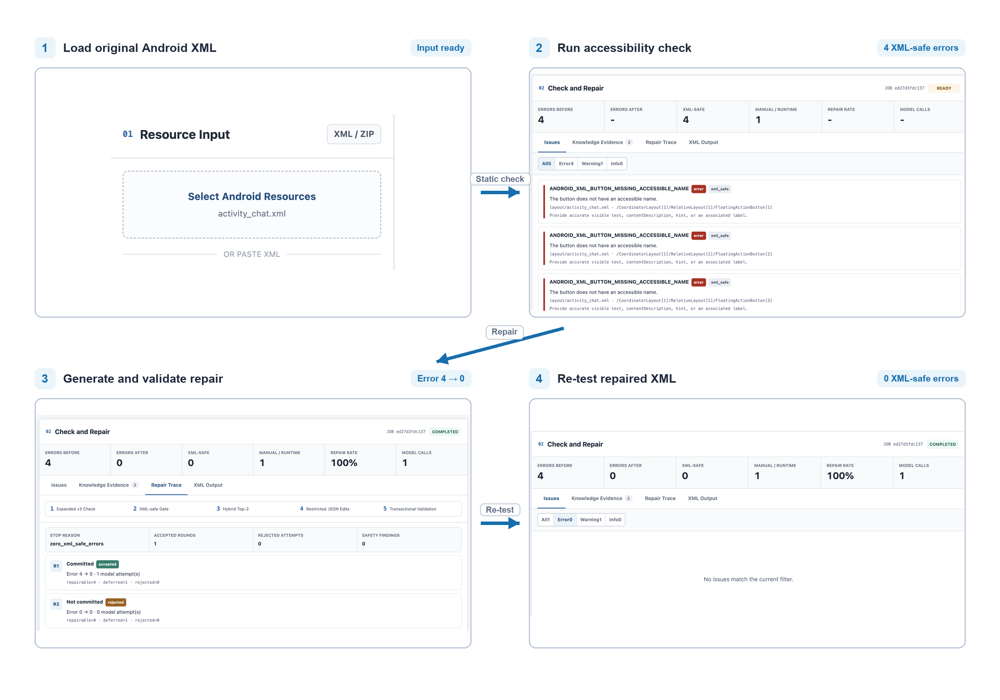

# SAFER-XML: Implementation and Dataset Artifact

SAFER-XML is a severity-aware, retrieval-grounded, and feedback-guided system for repairing high-confidence accessibility findings in Android View XML. The system separates statically repairable XML findings from runtime-dependent cases, retrieves issue-specific Android accessibility evidence, constrains model output to a restricted edit language, applies edits transactionally, and commits only validated improvements.

This repository contains the implementation, method specifications, frozen V2.3 benchmark inputs, and task manifests associated with the SAFER-XML study. The manuscript source, model-generated outputs, detailed run logs, and quantitative result tables are intentionally not included.

## End-to-end workflow



[Editable Visio source](assets/safer-xml-workflow.vsdx)

## Artifact scope

- 40 open-source Android applications
- 110 frozen XML repair tasks
- 136 high-confidence XML-safe findings
- 30 runtime-dependent or ambiguous boundary findings
- Frozen resource inputs, prompt material, knowledge documents, and registered experiment protocols
- Source code for checking, retrieval, constrained repair, validation, and the local demonstration interface

## Repository layout

```text
assets/                        Workflow figure and editable Visio source
tools/                         SAFER-XML detector, retrieval, repair, and web-demo code
knowledge/                     Structured accessibility knowledge base
tests/                         Unit and integration tests
web/                           Local English-language demonstration interface
experiments/                   Registered formal/ablation protocols and frozen task manifests
outputs/v2_dataset/            Frozen 40-app XML-safe candidate manifest
data/release_tables/           Human-readable app inventory and task-type distribution
data/archives/                 Frozen resource inputs, prompts, and retrieval traces
scripts/                       Release verification and archive extraction utilities
```

Only the source, methods, and frozen inputs for the final V2.3 study are included. Pilot material, model outputs, run records, and result tables are intentionally excluded.

## Quick verification

Python 3.10 or newer is recommended. The core analysis uses only the Python standard library.

```bash
python3 scripts/verify_release.py
python3 -m unittest discover -s tests -q
```

The bundled self-contained suite contains 167 tests for the detector, repair
contracts, retrieval, model-provider adapters, experiment runner, and web demo.
Tests tied only to superseded pilot protocols are not distributed because their
historical fixtures are outside this artifact's stated scope.

## Inspect frozen experiment inputs

The large immutable data are stored as compressed archives so the repository remains practical to clone. Extract them with:

```bash
python3 scripts/extract_archives.py
```

This writes to `data/extracted/` and preserves the following logical structure:

- `frozen_inputs/<task_id>/`: one immutable Android resource package per task;
- `frozen_prompts/<task_id>/`: baseline and RAG prompts plus retrieval traces;

Archive inventory:

| Archive | Files | Uncompressed | Compressed |
|---|---:|---:|---:|
| `frozen_inputs.tar.gz` | 22612 | 181.0 MiB | 38.6 MiB |
| `frozen_prompts.tar.gz` | 440 | 21.4 MiB | 4.2 MiB |

All archives and release files are covered by `SHA256SUMS`.

## Run the local demonstration

```bash
python3 tools/web_server.py --host 127.0.0.1 --port 8765
```

Then open `http://127.0.0.1:8765`.

Static checking does not require a model API. Model-backed repair requires one of `DEEPSEEK_API_KEY`, `OPENAI_API_KEY`, or `ANTHROPIC_API_KEY`. Never commit API keys or `.env` files.

## Re-running model experiments

A fresh model run requires access to the configured model providers and may differ because hosted endpoints, backend weights, routing, and nondeterministic generation can change. The public artifact preserves the frozen inputs, prompt material, retrieval traces, task manifests, and protocols needed to inspect the method and conduct a new run; it does not distribute the study's recorded outputs or results.

## Interpretation limits

SAFER-XML reduces detector-confirmed static XML findings. It does not establish complete WCAG conformance or complete application accessibility. Runtime behavior, dynamic semantics, TalkBack interaction, visual context, and disabled-user evaluation remain outside the static repair claim.

## Data and third-party code

The benchmark contains resource files extracted from open-source Android applications. `THIRD_PARTY_APPS.csv` records upstream repositories and frozen commits. Those files remain governed by their original upstream licences; this repository does not relicense them. Local absolute paths were replaced with `${REPO_ROOT}` and `${FDROID_ROOT}` in the release archives without changing experimental outcomes.

## Licence

No project-wide licence has been selected. Public visibility does not grant reuse rights beyond those provided by the applicable upstream licences. Verify the licence of each redistributed third-party app resource before reuse.

## Citation

The manuscript citation and archival DOI should be added after acceptance or archival deposit. For anonymous review, cite this repository as the SAFER-XML artifact and use an anonymized repository URL.
